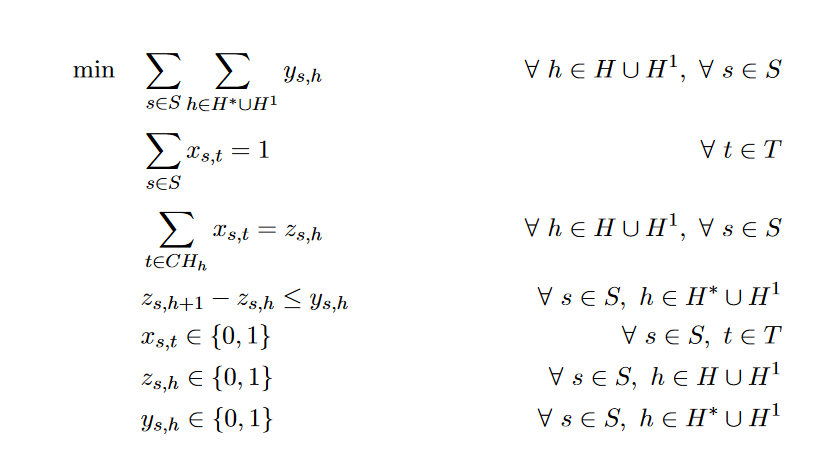

# Alocação de Salas de Aula - Modelo de Programação Linear Inteira

Este repositório contém o código e a documentação referente ao trabalho de alocação de salas de aula (Pasa) do Instituto de Computação (IC) da Universidade Federal de Alagoas (UFAL). O objetivo principal do projeto é reduzir o desperdício de energia por meio de um modelo de programação linear inteira.

## Visão geral

O problema de alocação de salas de aula é uma questão recorrente em instituições de ensino, onde é necessário otimizar a distribuição das salas disponíveis para as disciplinas e atividades acadêmicas. Neste trabalho, propomos um modelo de programação linear inteira que aborda esse problema específico no IC da UFAL.

O trabalho foi desenvolvido com base na alocação de salas de aulas para o período letivo 2021.2. Utilizamos os dados de alocação existentes como referência para resolver o problema e comparar os resultados com a solução atualmente adotada pelo instituto.

## Estrutura do repositório

O repositório está organizado da seguinte maneira:

- `cplex/`: Esta pasta contém os arquivos com o código fonte do modelo de programação linear inteira desenvolvido. 
- `instância/alocacao-professor-20212_EC_CC-v28/`: Nesta pasta, mostra a alocação de salas de aula do período letivo 2021.2.
- `solução/alocacao-professor-20212_EC_CC-v28/`: Esta pasta armazena os resultados obtidos a partir da resolução do modelo proposto.
- `README.md`: Este arquivo contém informações gerais sobre o repositório e as instruções para utilização.

## Formulação

Definições dos conjuntos usados:

- T = {1, 2, ..., Tn} - Turmas
- S = {1, 2, ..., Sn} - Salas
- H = {1, 2, ..., Hn} - Intervalos de tempo
- H^1 ⊆ H - Horários fictícios
- H^2 = H - {Hn}
- CH_h ⊆ T - Conflito de horários das turmas do intervalo h ∈ H

Variáveis binárias:

- xs,t - indica que a turma t ∈ T é alocada à sala s ∈ S
- zs,h - indica que a sala s ∈ S é utilizada no intervalo h ∈ H ∪ H^1
- ys,h - indica que a sala s ∈ S é aberta do intervalo h ∈ H ∪ H^1 para o intervalo h+1

Apresenta-se, a seguir, o modelo de programação linear inteira para minimização da soma da quantidade de vezes que as salas são abertas:

## Tabela de Salas do IC

A tabela a seguir apresenta as salas disponíveis no Instituto de Computação (IC) e seus respectivos usos:

| Sala               | Uso           |
|--------------------|---------------|
| Auditório          | Aula Teórica  |
| Lab 02             | Misto         |
| Lab 03             | Misto         |
| Sala 02            | Aula Teórica  |
| Sala 03            | Aula Teórica  |
| Lab Robótica       | Aula Prática  |
| Sala 204 Bloco 12  | Aula Teórica  |
| Sala 205 Bloco 12  | Aula Teórica  |
| Sala 206 Bloco 12  | Aula Teórica  |
| Sala 207 Bloco 12  | Aula Teórica  |
| Mini sala 01       | Aula Teórica  |
| Lab Controle       | Aula Prática  |
| Lab 01 Bloco 12    | Aula Prática  |
| Auditório CEPETEC  | Aula Teórica  |
| Lab Eletrônica     | Aula Prática  |
| Lab 01 AB          | Misto         |

